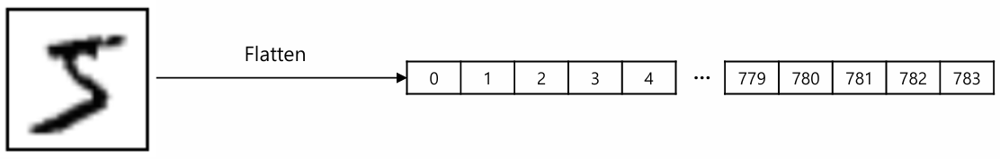
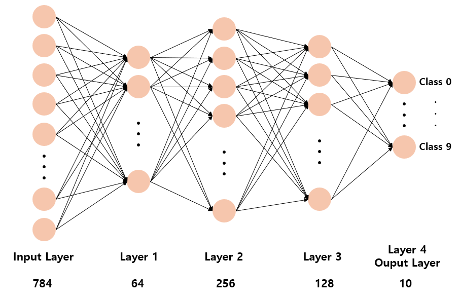
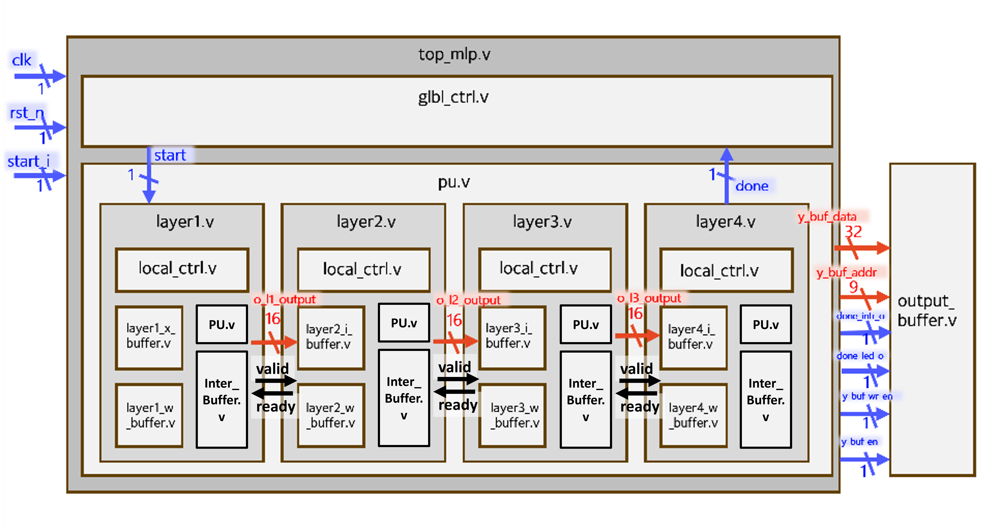
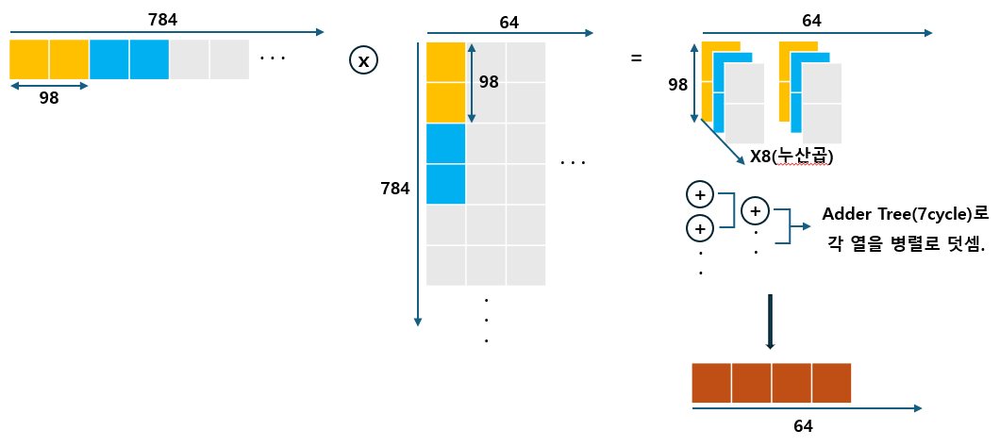
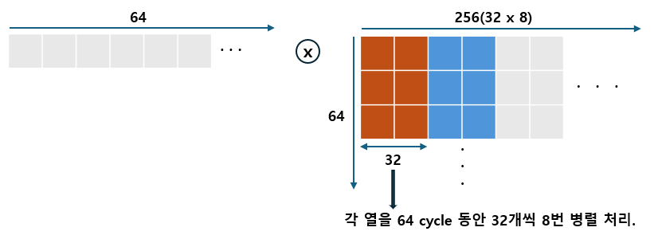
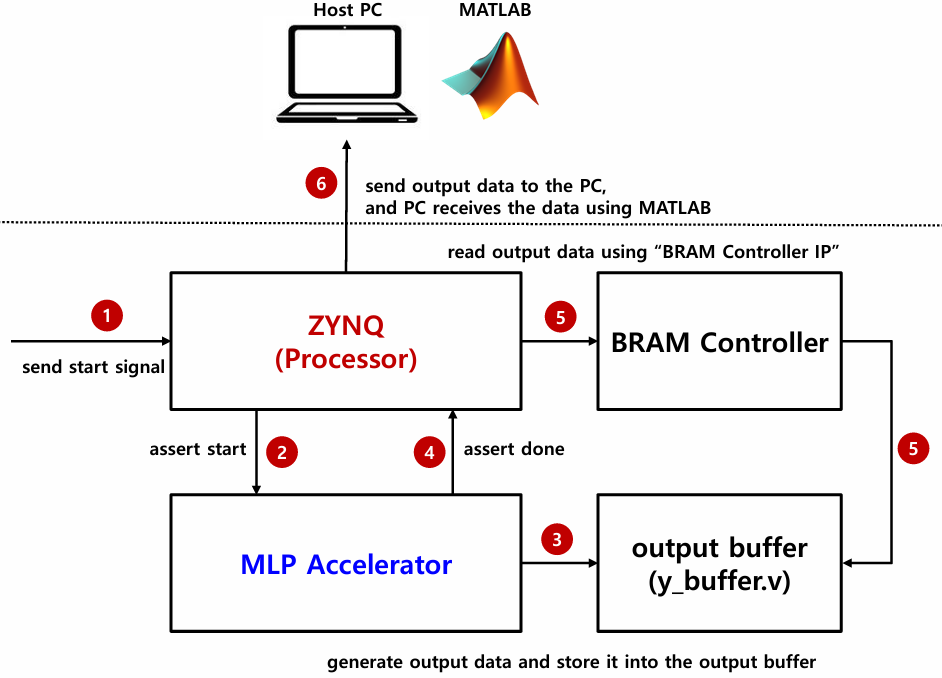

# 🧠 MLP Accelerator on FPGA
> Digital System Design Term Project – Stream-based FPGA Accelerator for 4-Layer MLP Inference  
> Low-latency inference achieved through fixed-point parallel MAC architecture and layer-wise pipelining

---

## 📌 Table of Contents
1. Project Overview  
2. System Architecture  
3. Key Design Features  
4. Hardware Platform & Implementation  
5. Verification Methodology  
6. UART Demo (MATLAB, 10 Frames)  
7. Results Summary  
8. References  

---

## 1. Project Overview
- **Course**: Digital System Design (Spring 2025)  
- **Objective**:  
  - Implement a dedicated hardware accelerator for a 4-layer MLP model on Zynq-7000 FPGA  
  - Prioritize low-latency inference with streamlined pipelining and balanced PU allocation  
- **Highlights**:  
  - Q8.8 fixed-point arithmetic optimized for DSP slices  
  - Layer-wise PU allocation for balanced throughput  
  - Valid/Ready handshake protocol for robust dataflow  
  - Bottom-up RTL design with modular verification  

### 🔹 Input Visualization
- The input 28×28 image is **flattened into a 784-dimensional vector** before entering the accelerator.  

  

### 🔹 Model Structure
The MLP model consists of **four fully connected layers**:  
```
Flattened Input (784) → FC1 (64) → FC2 (256) → FC3 (128) → FC4 (10)
```

- **Input**: Flattened 28×28 grayscale image (784 features)  
- **Hidden Layers**:  
  - Layer 1: 784 → 64 neurons  
  - Layer 2: 64 → 256 neurons  
  - Layer 3: 256 → 128 neurons  
- **Output Layer**: 10 neurons (digit classification logits)  

**📷 Model Structure:**  

  

### 🔹 Final Demo
- **Setup**:  
  - Ten consecutive input images are flattened and processed sequentially on the FPGA.  
  - Classification results for all 10 frames are collected on a host PC by **MATLAB **.  
- **Goal**: Demonstrate low-latency inference across multiple frames with hardware–software co-verification.

---

## 2. System Architecture
- **Overall Dataflow**:  
  1. **Input**: 784-dim normalized integer vector (1 sample, from 28×28 image)  
  2. **Processing Path**:  
     - Layer1 (784→64) → Layer2 (64→256) → Layer3 (256→128) → Layer4 (128→10)  
  3. **Output**: 10 logits for classification  
  4. **Control**: Global FSM synchronizes local FSMs per layer  

- **Block Diagram**:

  

---

## 3. Key Design Features
| Item              | Description |
|-------------------|-------------|
| Arithmetic Format | Q8.8 fixed-point (16-bit) |
| Activation        | ReLU (conditional operator) |
| Layer Design      | Fully Connected + PU Array (Adder Tree only in Layer 1) |
| Pipelining        | Independent FSMs, streamlined flow |
| Protocol          | Valid/Ready handshake |
| Control           | Global + Local FSM hierarchy |
| Input Scaling     | Zero-extension & fixed-point normalization |

---

## 4. Hardware Platform & Implementation
| Item            | Specification |
|-----------------|---------------|
| FPGA Platform   | Xilinx Zynq-7000 (Z7-20) |
| Target Frequency| 125 MHz |

### 🔹 Timing Summary
| Metric                         | Value |
|--------------------------------|-------|
| Worst Negative Slack (WNS)     | +0.229 ns |
| Total Negative Slack (TNS)     | 0.000 ns |
| Worst Hold Slack (WHS)         | +0.016 ns |
| Total Hold Slack (THS)         | 0.000 ns |
| Worst Pulse Width Slack (WPWS) | +2.750 ns |
| All Timing Constraints         | Met ✅ |

### 🔹 Resource Utilization
| Resource | Utilization | Available | Utilization % |
|----------|-------------|-----------|---------------|
| LUT      | 18,693      | 53,200    | 35.14% |
| LUTRAM   | 245         | 17,400    | 1.41% |
| FF       | 30,841      | 106,400   | 28.99% |
| BRAM     | 70.5        | 140       | 50.36% |
| DSP      | 204         | 220       | 92.73% |
| IO       | 4           | 125       | 3.20% |

---

### 🔹 Layer 1: 784 × 64 Fully Connected
- **Operations**: 50,176 MAC  
- **Resources**: 98 DSP slices  
- **Cycles**: ~584  
- **Structure**:  
  - 98 DSPs used for parallel MAC computation  
  - Partial sums merged via **Adder Tree**  
  - Final results stored in buffer  
- **Layer 1 Dataflow**:
  
  

---

### 🔹 Layer 2–4: Fully Connected Layers (Shared Dataflow)

- **Common Structure**:  
  - PU array executes multiple neurons in parallel per cycle  
  - Each PU repeatedly performs MAC operations with DSP slices  
  - Identical dataflow architecture across all three layers  
  - Valid/Ready handshake ensures synchronized pipeline  

**📷 Layer 2–4 Dataflow:**  

  

#### ▪ Layer 2: 64 × 256  
- Operations: 16,384 MAC  
- Resources: 32 DSPs  
- Cycles: ~528  

#### ▪ Layer 3: 256 × 128  
- Operations: 32,768 MAC  
- Resources: 64 DSPs  
- Cycles: ~516  

#### ▪ Layer 4: 128 × 10  
- Operations: 1,280 MAC  
- Resources: 10 DSPs  
- Cycles: ~128  

---

## 5. Verification Methodology
- **Simulation**:  
  - Testbenches for PE, controller, and buffers  
  - RTL outputs are compared with a **MATLAB reference implementation**  
- **On-Board Testing**:  
  - Data I/O via text files for batch tests  
  - ILA probes verify Valid/Ready timing and layer handshakes  
  - Final demo additionally uses **UART** for a 10-frame live showcase  

**📷 Final Demo Environment:**  

  

---

## 6. UART Demo (MATLAB, 10 Frames)

- **Interface**: COM7 @ 115200 bps, 8N1, CR/LF terminator  
- **Data Transfer**: Since UART bandwidth is 8-bit, each 32-bit value is sent in 4 chunks.  
- **Demo Flow**:
  1. FPGA streams out a `10 × 10` logits matrix (10 frames, 10 classes each).  
  2. MATLAB reconstructs 32-bit values from the byte stream.  
  3. Post-processing is applied: **ReLU → normalization → softmax**.  
  4. Top-1 class prediction per frame is extracted.  
  5. Each input image (0–9) is displayed with predicted label and probability.  

- **Outcome**:  
  - Real-time classification of 10 consecutive frames  
  - Visualized predictions with probability percentages  

---

## 7. Results Summary
| Metric            | Result |
|-------------------|--------|
| Total Latency     | 1756 cycles |
| Throughput        | ~71,206 samples/sec (at 125 MHz) |
| DSP Utilization   | 204 / 220 (92.27%) |
| Accuracy          | RTL outputs matched **MATLAB reference** |
| Demo              | **10-frame UART** showcase with per-frame softmax/top-1 |
| Debugging         | FSM synchronization bug fixed via ILA |
| Optimization      | PU allocation proportional to workload → minimized bottlenecks |

---

## 8. References
- Course Materials: *Digital System Design* (Spring 2025, Prof. Hyun Kim)  
- Advanced Practices 1–3: DSP usage, controller design, and quantization  

---
